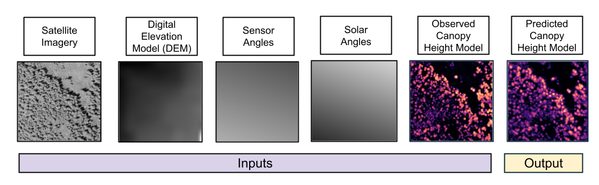

# SatCHM

## Motivation

Canopy Height Models (CHMs) are useful tools for a wide variety of applications: 3D construction of wildland fuels, biomass estimates, land management, tracking deforestation, etc (Linn et al., 2020; Marcozzi et al., 2025). High-resolution CHMs are usually obtained from processing Digital Terrain Models (DTMs) from LiDAR data and subtracting those from Digital Elevation Models (DEMs) (Allred et al., 2025). However, LiDAR data is expensive and is collected less frequently compared to satellite imagery (Dassot et al., 2011). Therefore, this program leverages a system of convolutional neural networks (MS-net) to predict CHMs from satellite imagery.
## Description

These are the required inputs to use SatCHM, followed by the output:



<br>
<div style="text-align:center">
  <table style="margin: 0 auto; border-collapse: collapse;" border="1">
    <tr>
      <th>Inputs</th>
      <th>Description</th>
    </tr>
    <tr>
      <td>Satellite Imagery</td>
      <td>Input satellite imagery must be cloudless, panchromatic GeoTIFFs that have a resolution of 0.5 - 0.6 meters with discernable crowns; target azimuth, off-nadir angle, solar azimuth, and solar elevation metadata must be able to documented for each image. <strong>The off-nadir angle for each angle must be < 20°.</strong>
 </td>
    </tr>
	<tr>
      <td>Digital Elevation Models (DEMs)</td>
      <td>Input DEMs of the target area should at least be 30 meters resolution</td>
	  <tr>
      <td>Solar and Sensor Angles</td>
      <td>Solar and sensor inputs are created with SatCHM using the target azimuth, off-nadir angle, solar azimuth, and solar elevation metadata from the satellite imagery </td>
    </tr>
	<tr>
      <td>Lidar-produced CHMs </td>
      <td> Input lidar-produced CHMs should be at 0.5 - 0.6 meters or finer resolutions </td>
    </tr>
  </table>
</div>

</br>

## How to run SatCHM

### Refer to [howToRunSatCHM.md](howToRunSatCHM.md)


## Authors

- Mia Mitchell **[mitchell.mia01@gmail.com]** (corresponding)
- Chuck Abolt **[chuck.abolt@gmail.com]**
- Zachary Crennen **[zcrennen@lanl.gov]**
- Adam Atchley **[aatchley@lanl.gov]**

## Version History
1.0.0 (January 2026)

## License

O#: O5010

This program is Open-Source under the BSD-3 License.

Redistribution and use in source and binary forms, with or without modification, are permitted provided that the following conditions are met:

Redistributions of source code must retain the above copyright notice, this list of conditions and the following disclaimer.
 
Redistributions in binary form must reproduce the above copyright notice, this list of conditions and the following disclaimer in the documentation and/or other materials provided with the distribution.
 
Neither the name of the copyright holder nor the names of its contributors may be used to endorse or promote products derived from this software without specific prior written permission.
THIS SOFTWARE IS PROVIDED BY THE COPYRIGHT HOLDERS AND CONTRIBUTORS "AS IS" AND ANY EXPRESS OR IMPLIED WARRANTIES, INCLUDING, BUT NOT LIMITED TO, THE IMPLIED WARRANTIES OF MERCHANTABILITY AND FITNESS FOR A PARTICULAR PURPOSE ARE DISCLAIMED. IN NO EVENT SHALL THE COPYRIGHT HOLDER OR CONTRIBUTORS BE LIABLE FOR ANY DIRECT, INDIRECT, INCIDENTAL, SPECIAL, EXEMPLARY, OR CONSEQUENTIAL DAMAGES (INCLUDING, BUT NOT LIMITED TO, PROCUREMENT OF SUBSTITUTE GOODS OR SERVICES; LOSS OF USE, DATA, OR PROFITS; OR BUSINESS INTERRUPTION) HOWEVER CAUSED AND ON ANY THEORY OF LIABILITY, WHETHER IN CONTRACT, STRICT LIABILITY, OR TORT (INCLUDING NEGLIGENCE OR OTHERWISE) ARISING IN ANY WAY OUT OF THE USE OF THIS SOFTWARE, EVEN IF ADVISED OF THE POSSIBILITY OF SUCH DAMAGE.

## Citation

Please use the following citation if using our work:

```
@article{abolt2025deep,
  title        = {Deep-learning-based canopy height model generation from sub-meter resolution panchromatic satellite imagery},
  author       = {Abolt, Charles J. and Santos, Javier E. and Atchley, Adam L. and Wells, Lucas and Martin, Daithi and Parsons, Russell A. and Linn, Rodman R.},
  journal      = {Machine Learning: Science and Technology},
  year         = {2025},
  volume       = {6},
  number       = {015013},
  doi          = {10.1088/2632-2153/ada47e},
  url          = {https://www.fs.usda.gov/rm/pubs_journals/2025/rmrs_2025_abolt_c001.pdf}
}
```

## Sources
Allred, B. W., McCord, S. E., & 	Morford, S. L. (2025). Canopy height model and NAIP imagery pairs across CONUS. Scientific Data, 12(1), 322. https://doi.org/10.1038/s41597-025-04655-z

Dassot, M., Constant, T., & Fournier, M. (2011). The use of terrestrial LiDAR technology in forest science: Application Fields, Benefits and Challenges. Annals of Forest Science, 68, 959-974. https://doi.org/10.1007/s13595-011-0102-2

Linn, R. R., Goodrick, S. L., Brambilla, S., Brown, M. J., Middleton, R. S., O'Brien, J. J., & Hiers, J. K. (2020). QUIC-fire: A fast-running simulation tool for prescribed fire planning. Environmental Modelling & Software, 125, 104616. https://doi.org/10.1016/j.envsoft.2019.104616

Marcozzi, A., Wells, L., Parsons, R., Mueller, E., Linn, R., & Hiers, J. K. (2025). FastFuels: Advancing wildland fire modeling with high-resolution 3D fuel data and data assimilation. Environmental Modelling & Software, 183, 106214. https://doi.org/10.1016/j.envsoft.2024.106214

## Acknowledgments
This research was funded and supported by the Laboratory Directed Research and Development under 'Experiemental Research' at Los Alamos National Laboratory. Thank you to the entire FIRE team and others in the Earth and Environmental Sciences division, including but not limited to Agnese Marcato, Julia Oliveto, Javier Santos, and Rod Linn. 
